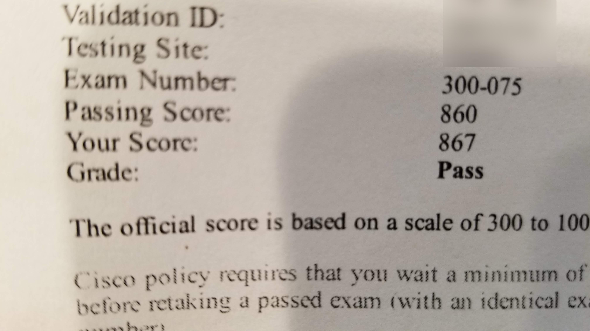

I just got back from my first Cisco Live US, held June 10-14 at the Orange County Convention Center in Orlando. Five days, tens of thousands of network people, and one convention center so large it has its own weather.

I've wanted to go to Cisco Live for years. Every June I'd watch the keynote streams from my desk and tell myself "next year." This year it finally happened, and now that my feet have mostly recovered, here's what stuck with me as a first-timer.

## The scale is the first thing that gets you

Nothing prepares you for walking into the OCCC on day one. The attendee count was somewhere north of 25,000 people, and the building is genuinely measured in miles. My phone logged more steps per day than some weeks back home.

The practical consequence: you cannot do everything. I showed up with a schedule packed wall to wall, and by Tuesday afternoon I had already blown it up. Sessions on opposite ends of the convention center are effectively in different zip codes, and June in Orlando means any walk outside comes with a complimentary sauna.

Lesson one for future me: schedule fewer things, leave gaps, and pick sessions by location as much as by topic.

## Keynotes: intent-based networking everywhere

Chuck Robbins opened the week, and the big themes were the ones Cisco has been pushing hard since last year: intent-based networking, DNA Center, security, and multicloud. The pitch is that we stop configuring boxes one CLI session at a time and start declaring what we want the network to do, then let software handle the how.

As someone who spends a lot of time in SSH sessions typing the same commands into the same switches, I'm the target audience for this. I'm also a network engineer, which means I'm professionally skeptical. The demos looked slick, but demos always look slick. The part that actually got my attention was Cisco opening up DNA Center's APIs to developers, because APIs are something I can go poke at myself instead of taking a keynote's word for it.

The keynote arena itself is an experience: giant screens, live music, thousands of badge lanyards in one room. Even if you stream the keynotes later, being in the room for at least one is worth it.

## The DevNet Zone was the surprise of the week

I went to Cisco Live expecting the breakout sessions to be the main event. Instead, the place I kept coming back to was the DevNet Zone.

If you haven't seen it, DevNet is Cisco's developer program, and their zone on the floor is part classroom, part hackerspace. Hands-on workstations, guided coding exercises, people walking you through Python, REST APIs, and network automation basics at whatever level you're starting from. During the week they announced DevNet had crossed 500,000 registered members, which tells you this isn't a side project anymore.

This is the part that tripped me up, in a good way. I came for routing and switching content and left thinking mostly about automation. Sitting at a workstation making API calls against real gear made the whole "network engineers should learn to code" drumbeat feel less like a threat and more like an invitation. I've dabbled in scripting before, but this was the first time I saw a clear path from "I write one-off scripts" to "I build actual tools."

If you're a network person on the fence about the programmability stuff, the DevNet Zone alone justifies the trip.

## Breakouts and the World of Solutions

The breakout sessions were a mixed bag, which I'm told is normal. The best ones were the deep technical dives where a presenter clearly lived with the technology daily. The weaker ones were thinly disguised product pitches. You learn to read session abstracts with a more cynical eye by day two.

Pro tip I learned too late: popular sessions fill up in the scheduler weeks before the event. Register early, and if a session you want is full, show up anyway. Walk-in lines often get seats.

The World of Solutions expo floor is sensory overload: hundreds of vendor booths, demos in every direction, and enough free t-shirts to restock your entire home wardrobe. It's easy to burn a whole day there. I'd budget a couple of focused hours instead, hit the vendors you actually have questions for, and treat the rest as a bonus.

## I passed CIPTV2 by the skin of my teeth

Cisco Live is a good place to knock out an exam if you've been putting one off, since the full conference pass includes one. I'd been putting off the 300-075 CIPTV2 exam, so I booked a seat at the on-site testing center.

Here's the thing: I did zero studying for it. Work kept me completely buried in the weeks before the conference, and my backup plan was to cram on the flight to Orlando. Instead I spent the flight too tired to do anything but exist. So I walked into the exam room on nothing but whatever CIPTV2 knowledge my day job had beaten into me.

Passing score: 860. My score: 867. Seven points. I'll take it. There's an argument that a pass this narrow with literally no studying is the most efficient exam prep possible - any studying would have been wasted effort on points I didn't need. I don't recommend the strategy, but I'm not giving the cert back either.

## Yes, there was a party

The Customer Appreciation Event took over Universal Studios for a night, with Bruno Mars headlining. It's a strange and great experience to ride roller coasters with a few thousand network engineers, most of whom were visibly doing math on how the park's WiFi was holding up.

Beyond the big party, the hallway track was the real social event. Some of the most useful conversations I had all week happened in line for coffee, comparing notes with people running networks completely different from mine. Everyone has the same problems with slightly different logos on the hardware.

## What I'd tell a first-timer (including 2017 me)

- Wear real shoes and drink water. The convention center is a cardio program with a badge.
- Don't over-schedule. The sessions are recorded; the hallway conversations and hands-on labs are not.
- Spend real time in the DevNet Zone, even if you think the coding stuff isn't for you yet. Especially if you think that.
- Your conference pass includes an exam. Use it - though maybe study a little more than I did.

Would I go back? Absolutely. Between the DevNet spark and a backlog of session recordings to catch up on, I've got homework for months. If you've been doing the "next year" routine like I was, break the cycle. It's worth it.
